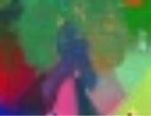
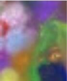

# Spectral-Matting-CPP

This is a C++ implementation of Spectral Matting approach based on OpenCV.

The referenced paper can be found [here](https://dl.acm.org/doi/10.1109/TPAMI.2008.168).

# Setup

* Set up OpenCV  2.4.11

* Set up [Eigen 3.3.4](http://eigen.tuxfamily.org/index.php?title=Main_Page)

* SPmain.cpp

  Change the path of input/output image

# Result

Test Example 1: 

Test Example 2: 

Extra Note:

Since the limitation of the Eigen lib, the image size should not be too large.